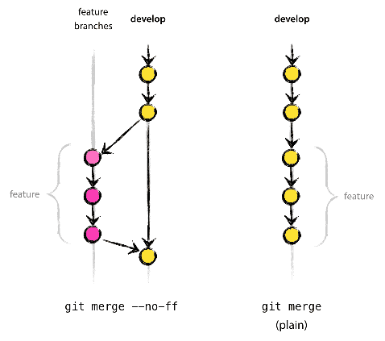

# lab 04
author: Jarosław Bulat
## 1. Introduction to GIT 

GIT: **everything-is-local**

"Git was created by Linus Torvalds in 2005 for development of the Linux kernel" [source](https://en.wikipedia.org/wiki/Git)

If you known VCS or SVN (Subversion), forget them to avoid confusion. GIT is not "better SVN" it is different. It is centralized vs distributed approach. SVN (and other previous VCS) are central repositories, based on client-server paradigm. 

GIT is a distributed control system. Everything could be local: branches, complete history. It could works without network connection. It could have many central repositories.

  
[source](https://iedf.in/index.php/learn/courses/68-introduction-to-git-github)

  
[source](http://nvie.com/posts/a-successful-git-branching-model/)

## 2. GIT by commands (Cheatsheet)

0. Create `git` directory and execute `cd git`. It is not obligatory, however, it is good practice to have a directory dedicated to various git repositories

1. `git clone https://github.com/MiTPMaPT/MaPT_19_20_I` setup local repository and download files from remote to local  
`cd MaPT`  
`ls -al`  
Now you can change something locally eg: 'echo "myName" >> new_file.txt'

2. `git add .` add files to local repository, update index

3. `git commit -am "obligatory short comment"` record changes to the repository

4. `git push` transfer files to remote repo (update files on remote side)
Do not `git push -f` !!! It remove history.

5. `git pull` download files from remote to local (current branch)  
git pull have to be executed from git directory, `MaPT` in this example
`git pull --all` Pull all branches 

6. `git branch -a` show all available (existed in this repository) branches  
`git branch -r` only remote  
`git branch -a` remote and local (all)

7. `git checkout other_branch` switch branches, it will be "pulled" from origin if necessary, if it is already locally git switch but not update. Checkout from branch X to branch Y will results in replacing files from X branch by files from Y branch. Git refuse to replace uncommitted files. Git do not change any untracked files (not added or enumerated in `.gitignore` file)

8. `git checkout -b new_branch` create a new branch (locally)  
it will be created on the basis of current branch  
`touch something`  
`git add .`  
`git commit -am "obligatory short comment"`  
`git push -u origin new_branch` only first time, then `git push`

9. remove files from repository:  
`rm something.txt`  
`git add .` in order to remove you have to "add" ;-)  
`git commit -am "remove something"`  
`git push`

10. `git status` show status of local repository
show untracked files

11. `git log -3` show last 3 commits

12. `git merge master` join two branches,  
Try to import master (local) branch to current (local) branch. Current branch could be either master or other branch. Merging will not change anything in remote repository. Merge will be done automatically unless conflict occurs. Conflict means someone change the same line you have changed. Git will mark this line(s) in the code, provide both version and leave the decision for you, which line is correct.

13. `git fetch` download information (not files) from origin repo, no file will be changed in local or remote repo  

14. `git reset --hard` give up and start with clean repository (like `git clone ....`)

15. `.gitignore` dot-file, describe what files should be ignored, eg: `*.tmp` in `.gitignore` means that all "temporary" files in this directory will be ignored by git.  
For example, file of the name README.md.tmp will not be added to index by the command `git add .`. In other words, git will ignore this file and do not perform any action on it.

16. Restore removed file (checkout from history): if you remove file or change it (long time ago) it is possible to bring it back, because all changes are track in repository. Execute `git log` to see last commits chose one of them na checkout. It will looks like this: `git checkout a05d24ac715c4793807bfb9a70e457f531ec1e1e`. Hash is a unique name of commit. You can find it by means of `git log` or via WWW interface.

## 3. GIT by examples
### init git local repository (clone from remote)
`git clone https://github.com/MiTPMaPT/MaPT_19_20_I` setup local repository and download files from remote to local  

`cd MaPT`  
`git config --global user.name "Your Name"` **first time you need configure git: provide Name and e-mail**  
`git config --global user.email your@email.com` **in AGH labs you need to provide Name and e-mail each time after system reboot, because home directory is cleared after system reboot and all informations (including git settings) are deleted**  
`git config --global push.default simple` method for push (safe one)  
`git config --global credential.helper "cache --timeout=3600"` git will store you login/password for 3600 seconds after first login

### change someting in existing local git repository
`cd git/MaPT/` assume: git is configured (see above) and repository is cloned  
`git pull` download latest files from remote to local repository (so called **HEAD**)  
change something in local repository eg `vim README.md`  
`git commit -am "obligatory comment"` record changes to the repository  
`git push` 

### add new file to repository
`cd git/MaPT/` assume: git is configured (see above) and repository is cloned  
add new files in `MaPT` directory, eg: `vim new_file.txt`  
`git add .` update indexed files (eg. add new files)  
`git commit -am "new files or similar description"` record changes to the repository  
`git push`  

### remove files/dirs from repo
`cd git/MaPT/` assume: git is configured (see above) and repository is cloned  
remove something, eg: `rm -rf lab_02/`  
`git add .` update indexed files (eg. remove files)  
`git commit -am "remove files or similar description"` record changes to the repository  
`git push`  

### change branch
`cd git/MaPT/` assume: git is configured (see above) and repository is cloned  
`git branch -a` (optional) print all available branches, local and remote  
sample output:  
>>* master  
>>remotes/origin/brach123  
>>remotes/origin/common

means: available one local branch of the name `master` and two remote branches: `branch123` and `common`  
`git checkout common` change branch to `common`  
* if `common` is local, git change to it and do not `pull` recent version  
* if `common` is remote (not need to type `git checkout remotes/origin/common`), git create new branch and `pull` recent version from server  

### create new branch
`cd git/MaPT/` assume: git is configured (see above) and repository is cloned  
`git branch -a` (optional) to make sure name of the new branch is not already used  
`git checkout parent_branch` (optional) change to branch that will be parent of new branch
`git checkout -b my_branch` create new branch of the name `my_branch`, it will be created only locally! parent branch will be `parent_branch`  
`git add .` optional but you usually you want to add something
`git commit -am "comment"`  
`git push -u origin my_branch` push local branch of name `my_branch` to remote repository with name `my_branch`, this construction is obligatory only when first time branch is pushed to remote server, next time only `git push` is necessary

## 4. Git exercises
#### EX2.1: create branch
1. Create own branch
2. Create text file with your name as a content
3. Push branch to remote repository
4. Verify via WWW content of this file
5. Ask your college (next to you) to checkout your branch and verify content of the file

#### EX2.2: try pull without prior commit&push
1. Pull from remote repo
2. Change file locally
3. Try to pull from remote once again
Comments: git forbid it because it will destroy you recent work (files will be overwritten by older from remote repo)

#### EX2.3: try pull without prior push
1. Pull from remote repo
2. Change file locally
3. Commit it
4. Pull from remote repo
Comments: similar like EX2.2

#### EX2.4: correct push
1. Pull from remote repo
2. Change file locally
3. Commit it
4. Push it
5. Check result using WWW interface

#### EX2.5: status
EX2 to EX4, execute `git status` before pull

#### EX2.6: try push when modification on remote repo
1. Pull from remote repo
2. Change file X locally
3. Commit it
4. Change X file on remote repo (ask you college to do so)
5. Push
Comments: You try to overwrite newer file (on remote repository) by older one (form your local repository). Git refuse to do that, it suggest to pull from remote in order to perform merging on you local repository and this merged repository push again to remote repo.

### EX2.7 try to checkout non-commited branch
1. Pull from remote repo branch X
2. Change file
3. Checkout Y branch
Comments: You didn't commit changes (they will not be tracked) and try to change branch. If you do that you lost your changes. That is why, git refuse to do that. You have to commit before checkout other branch. It is, however, not necessary to push you changes to remote server before checkout.

## 5. Tools and references

**Tools**:
* git (command line tool)   <=== must-known (powerful)
* Eclipse IDE (via plugin)
* CLion IDE - native
* Code::Blocks IDE (none)
* WWW (github/GitLab)
* gitg (GTK+ interface)

**References**:
* [trygit](https://try.github.io) learn git in 15 minutes ;-)
* [git guide #1](http://rogerdudler.github.io/git-guide/)

